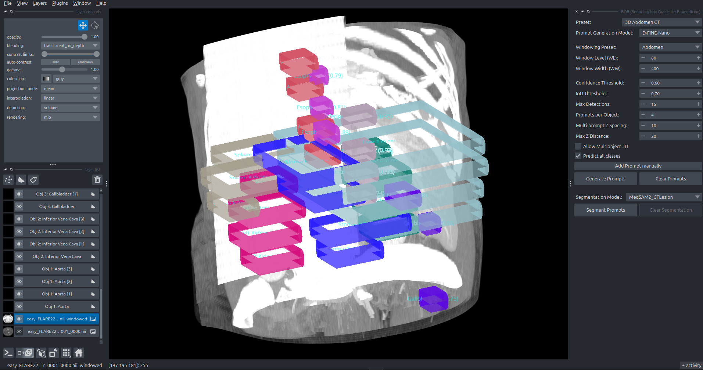

## Bounding-box Oracle for Biomedicine (BOB)
Anki Lab, Department Artificial Intelligence in Biomedical Imaging (AIBE), University of Erlangen-Nürnberg (FAU), Germany

[David Lurz](https://scholar.google.com/citations?user=u-vpuvwAAAAJ&hl=en),
[Luisa Neubig](https://scholar.google.com/citations?user=MaIlWfYAAAAJ&hl=en),
[Andreas Kist](https://scholar.google.com/citations?user=H8h7A44AAAAJ&hl=en)

[[`Paper`](https://doi.org/10.1007/978-3-658-51100-5_52)]
[[`BibTeX`](#bibtex)]
[[`Anki Lab`](https://anki.xyz/)]

BOB (Bounding-box Oracle for Biomedicine) is a prompt generator designed to be used with the MedSAM2 model.
It is trained on medical images, videos and 3D data to generate prompts for segmentation tasks.
This class provides methods to generate different types of prompts and assign classes to them,
which allows semantic and instance segmentation of many different medical objects of interest.
For 3D images, it generates bounding boxes for every slice in the volume which then
get de-duplicated using non-maximum suppression of the confidence scores for each class.
We also provide a napari plugin for easy usage of BOB in an interactive environment.



## Installation and Downloads

You can install `BOB` via pip:

```bash
pip install -e .
```

Dependencies:
- napari
- numpy
- torch
- MedVol
- ultralytics

For ease of use, you can also use the Makefile provided in the BOB root directory.

Some example images from multiple datasets can be [downloaded from Google Drive here](https://drive.google.com/drive/folders/14b9zoYAizITFiuQ92DeSbv4t5dGpsVol?usp=drive_link).

### Optional Dependencies

For video file support (MP4, AVI, MOV, MKV), install with the video extra:

```bash
pip install -e ".[video]"
```

This installs imageio with ffmpeg support for reading video files. Videos are automatically converted to grayscale for processing.


## Usage

1. Open napari in your Python environment `python -m napari`
2. Load your medical image data
3. Go to `Plugins > BOB (Bounding-box Oracle for Biomedicine)` to open the BOB widget
4. Configure parameters:
    - `Preset`: Choose a preset configuration for easy prompt generation
    - `Prompt Generation Model`: Select the model to use for prompt generation, e.g. YOLOv12n or D-FINE-N
    - `Confidence Threshold`: Minimum confidence score for detected objects (0.0-1.0)
    - `IoU Threshold`: Intersection over Union threshold for non-maximum suppression of YOLO models (0.0-1.0)
    - `Max Detections`: Maximum number of objects to detect per image (1-100)
    - `Prompts per Object`: Number of prompts to generate per object (=same object_id) in 3D
    - `Multi-prompt Z spacing`: Minimum distance between prompts for the same object in z-direction (after 3D clustering)
    - `Max Z Distance`: Maximum distance prompts can be apart in z-direction to be considered the same object (during 3D clustering)
    - `Allow Multiobject 3D`: Whether to allow multiple objects of the same type in 3D (otherwise all are assigned the same object_id)
    - `Predict all classes`: Whether the model should predict all supported classes or only the selected ones

5. Select your preferred Prompt Generation Model or preset and click "Generate Prompts" to create prompts for the active image layer
6. Click "Clear Prompts" to remove all generated prompt visualizations
7. Add manual box prompts by clicking "Add Prompt manually" and drawing boxes on the image
8. Select your preferred segmentation model in the dropdown menu and click on "Segment Prompts" to segment the currently active image layer using all available prompts

## Features

- Fast and lightweight prompt generation + segmentation, suitable for real-time applications
- Supports CPU, GPU and MPS (Apple Silicon) and automatically selects the best available device
- Interactive widget for prompt generation parameter configuration
- Support for both 2D and 3D medical images
- Visual prompt representation using napari Shapes layers
- Color-coded prompts by object ID
- Easy clearing of generated prompts

## Training Data and Models
BOB uses the object detection models [YOLOv12n](https://arxiv.org/abs/2502.12524) and [D-FINE-N](https://arxiv.org/abs/2410.13842).
The training data was sourced from the following datasets and collections.

- [BAGLS](https://www.bagls.org/)
- [NeoPolyp](https://www.kaggle.com/c/bkai-igh-neopolyp/)
- [Endoscapes](https://github.com/CAMMA-public/Endoscapes)
- [Brain Electron Microscopy](https://www.epfl.ch/labs/cvlab/data/data-em/)
- [IMed-361M](https://github.com/uni-medical/IMIS-Bench)
- [MedSegBench](https://medsegbench.github.io/)
- [FLARE22](https://flare22.grand-challenge.org/)
- [AMOS22](https://amos22.grand-challenge.org/)
- [ToothFairy3](https://ditto.ing.unimore.it/toothfairy3/)
- [Medical Decathlon](http://medicaldecathlon.com/)


## Citations
### BibTex
If you use BOB in your research, please cite the following paper:

```BibTeX
@InProceedings{lurz2026BOB,
author="Lurz, David
and Neubig, Luisa
and Kist, Andreas",
editor="Handels, Heinz
and Breininger, Katharina
and Deserno, Thomas
and Maier, Andreas
and Maier-Hein, Klaus
and Palm, Christoph
and Tolxdorff, Thomas",
title="Adaptive Automatic Prompt Generation Assistant for Segmentation Foundation Models",
booktitle="Bildverarbeitung f{\"u}r die Medizin 2026",
year="2026",
publisher="Springer Fachmedien Wiesbaden",
address="Wiesbaden",
pages="259--266",
abstract="A variety of interactive segmentation foundation models are available, achieving strong performance in various domains of medical image segmentation. Many of these models, such as MedSAM2, require input prompts in the form of point coordinates or boxes. This prompt creation, however, is a time-consuming and error-prone task. To address this, we propose BOB, the Bounding-box Oracle for Biomedicine. By training lightweight 2D object detection models on the bounding boxes of annotated medical segmentation datasets, it can generate box prompts for medical images, videos, and volumes, allowing faster prompt generation while still keeping a human-in-the-loop architecture.  We trained YOLOv12n and D-FINE-N with 30 classes on around 50k diverse images across more than 10 modalities. An algorithm to cluster the prompts and filter by object and prompt quality ensures appropriate behavior in multi-dimensional images. By combining the generated prompts with a segmentation foundation model, we are able to quickly perform semantic and instance segmentation with optional human-in-the-loop. Compared to theoretically perfect box prompts generated from the ground truth, we could achieve around 90-110{\%} mIoU performance across scenarios, rivaling state-of-the-art specialized deep neural networks. To allow prompt generation, visualization, interactive refinement, and subsequent segmentation of the prompts, we provide a napari plugin. Our code and full results are openly available at https://github.com/DavidL-11/BOB.",
isbn="978-3-658-51100-5"
}
```

### References

The following list of citations contains publications related to our work:

```BibTeX
@article{gomez_bagls_2020,
	title = {{BAGLS}, a multihospital Benchmark for Automatic Glottis Segmentation},
	doi = {10.1038/s41597-020-0526-3},
	journaltitle = {Scientific Data},
	author = {Gómez, Pablo and Kist, Andreas M. and Schlegel, Patrick and Berry, David A. and Chhetri, Dinesh K. and Dürr, Stephan and Echternach, Matthias and Johnson, Aaron M. and Kniesburges, Stefan and Kunduk, Melda and Maryn, Youri and Schützenberger, Anne and Verguts, Monique and Döllinger, Michael},
}
```
```BibTeX
@article{FLARE22-LDH2024,
	title = {Unleashing the strengths of unlabelled data in deep learning-assisted pan-cancer abdominal organ quantification: the FLARE22 challenge},
	author = {Jun Ma and Yao Zhang and Song Gu and Cheng Ge and Shihao Ma and Adamo Young and Cheng Zhu and Xin Yang and Kangkang Meng and Ziyan Huang and Fan Zhang and Yuanke Pan and Shoujin Huang and Jiacheng Wang and Mingze Sun and Rongguo Zhang and Dengqiang Jia and Jae Won Choi and Natália Alves and Bram {de Wilde} and Gregor Koehler and Haoran Lai and Ershuai Wang and Manuel Wiesenfarth and Qiongjie Zhu and Guoqiang Dong and Jian He and Junjun He and Hua Yang and Bingding Huang and Mengye Lyu and Yongkang Ma and Heng Guo and Weixin Xu and Klaus Maier-Hein and Yajun Wu and Bo Wang},
	journal = {The Lancet Digital Health},
	year = {2024},
	doi = {https://doi.org/10.1016/S2589-7500(24)00154-7} 
}
```
```BibTeX
@article{ji2022amos,
	title={AMOS: A Large-Scale Abdominal Multi-Organ Benchmark for Versatile Medical Image Segmentation},
	author={Ji, Yuanfeng and Bai, Haotian and Yang, Jie and Ge, Chongjian and Zhu, Ye and Zhang, Ruimao and Li, Zhen and Zhang, Lingyan and Ma, Wanling and Wan, Xiang and others},
	journal={arXiv preprint arXiv:2206.08023},
	year={2022}
}
```
```BibTeX
@article{murali2023endoscapes,
      title={The Endoscapes Dataset for Surgical Scene Segmentation, Object Detection, and Critical View of Safety Assessment: Official Splits and Benchmark}, 
      author={Aditya Murali and Deepak Alapatt and Pietro Mascagni and Armine Vardazaryan and Alain Garcia and Nariaki Okamoto and Guido Costamagna and Didier Mutter and Jacques Marescaux and Bernard Dallemagne and Nicolas Padoy},
      journal={arXiv preprint arXiv:2312.12429},
      year={2023},
}
```
```BibTeX
@article{alapatt2021temporally,
  title={Temporally Constrained Neural Networks (TCNN): A framework for semi-supervised video semantic segmentation},
  author={Alapatt, Deepak and Mascagni, Pietro and Vardazaryan, Armine and Garcia, Alain and Okamoto, Nariaki and Mutter, Didier and Marescaux, Jacques and Costamagna, Guido and Dallemagne, Bernard and Padoy, Nicolas},
  journal={arXiv preprint arXiv:2112.13815},
  year={2021}
}
```
```BibTeX
@inproceedings{lucchi_learning_2013,
	location = {Portland, {OR}, {USA}},
	title = {Learning for Structured Prediction Using Approximate Subgradient Descent with Working Sets},
	url = {http://ieeexplore.ieee.org/document/6619103/},
	doi = {10.1109/cvpr.2013.259},
	eventtitle = {2013 {IEEE} Conference on Computer Vision and Pattern Recognition ({CVPR})},
	publisher = {{IEEE}},
	author = {Lucchi, Aurelien and Li, Yunpeng and Fua, Pascal},
	date = {2013-06},
}
```
```BibTeX
@article{Ku2024,
	title = {MedSegBench: A comprehensive benchmark for medical image segmentation in diverse data modalities},
	url = {http://dx.doi.org/10.1038/s41597-024-04159-2},
	DOI = {10.1038/s41597-024-04159-2},
	author = {Kuş,  Zeki and Aydin,  Musa},
	year = {2024},
}
```
```BibTeX
@article{2024IEEEACCESS,
	title={{Enhancing Patch-Based Learning for the Segmentation of the Mandibular Canal}},
	doi={https://doi.org/10.1109/ACCESS.2024.3408629},
	publisher={IEEE},
	year={2024},
	journal={IEEE Access},
	author={Lumetti, Luca and Pipoli, Vittorio and Bolelli, Federico and Ficarra, Elisa and Grana, Costantino},
}
```
```BibTeX
@misc{jha_kvasir-seg_2019,
    title = {Kvasir-{SEG}: {A} {Segmented} {Polyp} {Dataset}},
    shorttitle = {Kvasir-{SEG}},
    url = {http://arxiv.org/abs/1911.07069},
    doi = {10.48550/arXiv.1911.07069},
    author = {Jha, Debesh and Smedsrud, Pia H. and Riegler, Michael A. and Halvorsen, Pål and Lange, Thomas de and Johansen, Dag and Johansen, Håvard D.},
    year = {2019},
}
```
```BibTeX
@article{ma_segment_2024,
    title = {Segment anything in medical images},
    doi = {10.1038/s41467-024-44824-z},
    journal = {Nature Communications},
    author = {Ma, Jun and He, Yuting and Li, Feifei and Han, Lin and You, Chenyu and Wang, Bo},
    year = {2024},
}
```
